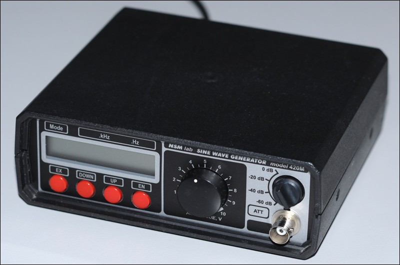

# SG-420M

Прошивка модифицирована для работы с экранами на контроллере [HD44780](https://ru.wikipedia.org/wiki/HD44780), размером 16x2, такими как WH1602.
Подключение экрана аналогично подключению в частотомере [FC-510](http://leoniv.diod.club/projects/measuring/fc-510/fc-510.html)

#### Общий вид генератора

#### Вид лицевой панели

#### Схема подключения экрана

#### Автор конструкций генератора и базовой прошивки

Ридико Леонид Иванович
* http://www.leoniv.diod.club
* http://leoniv.livejournal.com
* wubblick@yahoo.com
